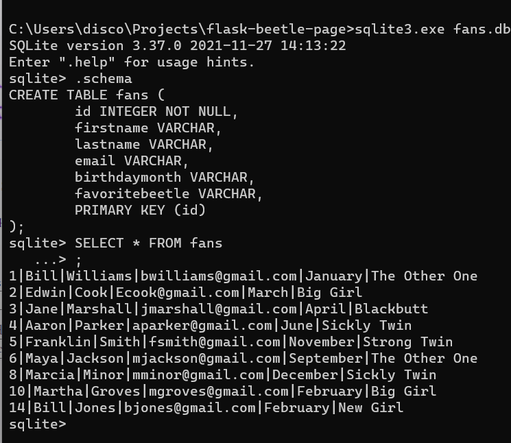

# Bernethia's Beetles

Bernethia's Beetles is a fan site for my beetles. It gives information about each of the beetles. Fans can sign up to receive a newsletter, and their information is saved in a database.

## Installation

Use the package manager [pip](https://pip.pypa.io/en/stable/) to install required python libraries. Check the file requirements.txt for versions.

```bash
pip install flask
pip install sqlalchemy
pip install flask-sqlalchemy
```

## Usage

```bash
python models.py
python app.py
```

## Features

*  [Watch](https://youtu.be/xX17-3npbzg) a tour of the website and demonstration of features.

*  This site is a web application using the Flask & SQLAlchemy libraries for Python. 

*  The website is designed mobile first, and it reorganizes for mobile, tablet and desktop views.

*  Clicking images in the "Meet My Beetles!" section reveals a related modal with a bio and larger picture. Clicking the "X" icon on the modal will hide it. 

*  When user clicks the button in the signup form, the required fields are validated on the client side, and, if in the correct format, the values are displayed in a welcome message to the user.

*  If required form field input is in the incorrect format or missing, error messages will appear below the form.

*  Correctly formated user input is saved in a database to serve as a contact list for the owner.


## History

This project uses code and content from [Bernethia's Beetles Fanpage](https://github.com/discolarrence/bernethias-beetles-fanpage), my first web development project.

## License
[MIT](https://choosealicense.com/licenses/mit/)
