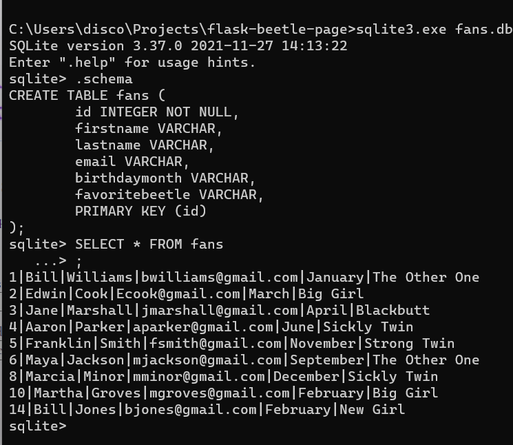

# Bernethia's Beetles

Bernethia's Beetles is a fan site for my beetles. It gives information about each of the beetles. Fans can sign up to receive a newsletter, and their information is saved in a database.

## Installation

Use the package manager [pip](https://pip.pypa.io/en/stable/) to install required python libraries. Check the file requirements.txt for versions.

```bash
pip install flask
pip install sqlalchemy
pip install flask-sqlalchemy
```

## Usage

```bash
python models.py
python app.py
```

## Features

[Watch](https://youtu.be/xX17-3npbzg) a tour of the website.

This site is a web application using the Flask & SQLAlchemy libraries for Python. The structure & content are contained in five HTML files. One file, layout.html, is the base template. The other four make up the four pages of the website. Two CSS files style the website. The first,[normalize.css](https://github.com/necolas/normalize.css/) is to help all browsers consitantly render the pages. The file style.css provides all styling unique to this website. Two JavaScript files provide the scripts for user interaction. The modals on the home page use script.js. The client-side form validation uses signup.js. Two python files build the web application. The model for the database is in models.py. The file app.py has all of the functions needed to run the application.

The website is designed mobile first, and it reorganizes the navigation menu, signup form and images for mobile, tablet and desktop views. This is accomplished by using CSS Flexbox, CSS Grid and media queries in style.css.

Clicking images in the "Meet My Beetles!" section reveals a related modal with a bio and larger picture. Clicking the "X" icon on the modal will hide it. This is accomplished in script.js by adding event listeners to the small, modal, and "X" images and changing the display style between "none" and "flex" when clicked.

When user clicks the button in the signup form, the required fields are validated on the client side. If required form field input is in the incorrect format or missing, error messages will appear below the form. This is accomplished in signup.js by adding event listeners to form fields and using RegEx and/or checking that all required fields have been filled out. For each invalid field, a corresponding error message is added to an array, and then each message in the array is displayed below the form. If all fields are correct, the values are inserted into a welcome message that is displayed to the subscriber. 

Input from the form is saved in a database to serve as a contact list for the owner. The database & table model is created in models.py. In app.py, alues from the form are added to the database in the function called at the signup page URL.



## License
[MIT](https://choosealicense.com/licenses/mit/)